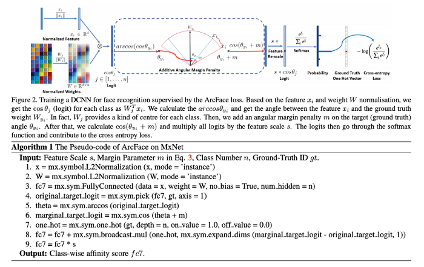

# README

## Team: **It's FaceTime**

### Patil Bhavesh Vasant | 18D170023

### Anuj Agrawal | 180110012

## Abstract

Face detection, face alignment, feature extraction, and finally face recognition. The human face is a dynamic object and has a high degree of variability in its appearance, which makes face detection a difficult problem in computer vision*.* 

It can be further analysed as 

- **Face Verification**. A one-to-one mapping of a given face against a known identity (e.g. *is this the person?*).
- **Face Identification**. A one-to-many mapping for a given face against a database of known faces (e.g. *who is this person?*)

We use a unique **[ArcFace](https://arxiv.org/pdf/1801.07698.pdf)** [1] ****based approach for calculation of face embeddings for the faces present in database. ***ArcFace* is a machine learning model that takes two face images as input and outputs the distance between them to see how likely they are to be the same person. It can be used for face recognition and face search**.  

## Method

*ArcFace* uses a *similarity learning* mechanism that allows *distance metric learning* to be solved in the classification task by introducing *Angular Margin Loss* to replace *Softmax Loss.* 

The distance between faces is calculated using *cosine distance*, which is a method used by search engines and can be calculated by the inner product of two normalized vectors. If the two vectors are the same, θ will be 0 and cosθ=1. If they are orthogonal, θ will be π/2 and cosθ=0. Therefore, it can be used as a similarity measure. 

We use **[insightface](https://github.com/deepinsight/insightface)** [2] open source implementation for arcface which calculates the face embeddings(size: vector of 512 direction) for the faces. We used no particular accelerator but CPU for this approach. We used google colab and mounted google drive to fetch the data from the shared drive.

We took first 5000 datapoints into consideration to take inferences. We calculated cosine score for matching face embeddings and non-matching face embeddings and observed that the optimal threshold for the given facial data distribution lier around **0.2.** 

**Histogram for matching face embeddings**

**Histogram for non-matching face embeddings**

**Note:** X-axis: cosine score; Y-axis: Number of datapoints

Hence from the above observations cosine score of 0.2 is taken as a threshold for differentiating the matching and non-matching face embeddings. 

Cosine Score ≥ 0.2 —> Faces are matching and belong to same person

Cosine Score < 0.2 —> Faces are matching and belong to different persons 

## How to use

We provide well commented code file **FaceMatch.ipynb** in this repository.

## References

[1] ArcFace: Additive Angular Margin Loss for Deep Face Recognition; [https://arxiv.org/pdf/1801.07698.pdf](https://arxiv.org/pdf/1801.07698.pdf)

[2] InsightFace: 2D and 3D Face Analysis Project; [https://github.com/deepinsight/insightface](https://github.com/deepinsight/insightface)

[3] Deep Face Recognition: A Survey; [https://arxiv.org/pdf/1804.06655.pdf](https://arxiv.org/pdf/1804.06655.pdf)

[4] FaceNet: A Unified Embedding for Face Recognition and Clustering; [https://arxiv.org/pdf/1503.03832.pdf](https://arxiv.org/pdf/1503.03832.pdf)
